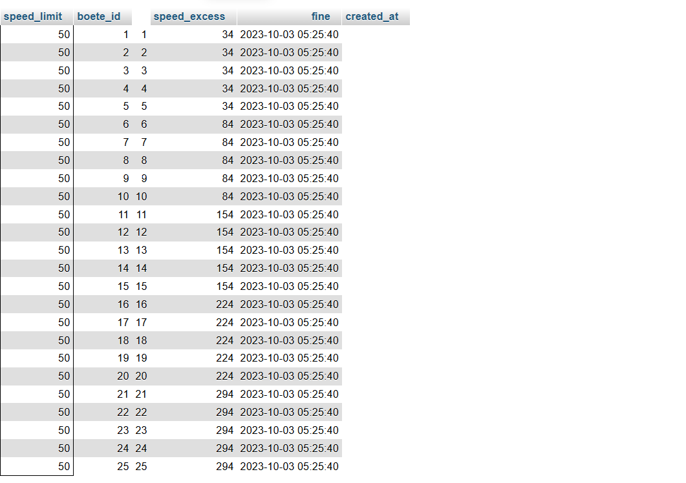

# Sql basis

### Database
Maak gebruik van het sql-bestand flits.sql en voer hierop onderstaande opdrachten uit.
Theorie kun je vinden op: https://www.edutorial.nl/dbq/introductie/

### Queries flitspaal
* Welke cameras zijn er en waar staan ze (id, address, city, max_speed).
SELECT 
    id,
    address,
    city,
    max_speed
FROM cameras;

* Overzicht van boetes op 50km wegen
SELECT id AS boete_id, speed_limit, speed_excess, fine, created_at FROM fines WHERE speed_limit = 50;

* Overzicht van overtredingen van 1 kenteken.
SELECT *
FROM flashes
WHERE license = 'F-943-VP';

* N.a.w.-gegevens van de hardrijders die het meest in de fout zijn gegaan. (top 10)
SELECT 
    l.first_name,
    l.last_name,
    l.address,
    l.city,
    f.license,
    COUNT(*) AS aantal_overtredingen,
    MAX(f.speed) AS hoogste_snelheid
FROM flashes f
JOIN licenses l 
    ON f.license = l.license
GROUP BY 
    l.first_name, l.last_name, l.address, l.city, f.license
ORDER BY 
    aantal_overtredingen DESC,
    hoogste_snelheid DESC
LIMIT 10;

* Welke camera’s (id, address, city) meten de meeste snelheidsovertredingen (top 10)
SELECT 
    c.id,
    c.address,
    c.city,
    COUNT(f.id) AS aantal_overtredingen
FROM flashes f
JOIN cameras c 
    ON f.camera_id = c.id
GROUP BY 
    c.id, c.address, c.city
ORDER BY 
    aantal_overtredingen DESC
LIMIT 10;

* Welke auto’s (kenteken, merk, type) zijn het meeste geflitst
SELECT 
    l.license,
    COUNT(f.id) AS aantal_flitsen
FROM flashes f
JOIN licenses l 
    ON f.license = l.license
GROUP BY 
    l.license
ORDER BY 
    aantal_flitsen DESC
LIMIT 10;

* Welke flitspaal (=camera met id, address, city) flitst het meest (top 10)
SELECT 
    c.id,
    c.address,
    c.city,
    COUNT(f.id) AS aantal_flitsen
FROM flashes f
JOIN cameras c 
    ON f.camera_id = c.id
GROUP BY 
    c.id, c.address, c.city
ORDER BY 
    aantal_flitsen DESC
LIMIT 10;

* Kentekens van auto’s die het hoogste bedrag aan boetes hebben gekregen (top 10)
SELECT 
    f.license,
    SUM(fi.fine) AS totaal_bedrag
FROM flashes f
JOIN fines fi 
    ON fi.id = f.id
GROUP BY 
    f.license
ORDER BY 
    totaal_bedrag DESC
LIMIT 10;

* Overzicht van auto’s (kenteken, merk, type) waarvan het kenteken overeenkomt met sitecode 10 (zoals X-999-XX) https://nl.wikipedia.org/wiki/Nederlands_kenteken.

SELECT 
    license
FROM licenses
WHERE license REGEXP '^[A-Z]-[0-9]{3}-[A-Z]{2}$';
